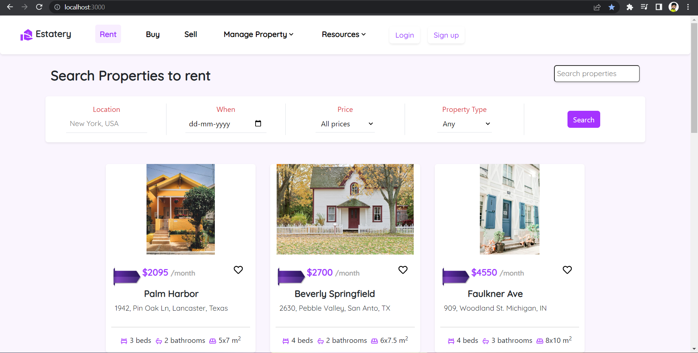

# Real Estate Property Filtering website

This website was made using react. It is an single page web application displaying properties
to buy, sell and rent. External packages or libraries include, Bootstrap as CSS framework, Google Fonts 
for fonts, pexels for images, `react-router-dom` for Routing and links and `react-icons` for some icons.

## Functionalities:-

1) Add to favorites button as heart icon❤️ on property card.
2) Filtering mechanism with attributes as Location, Moving Date, Price and Property Type.
3) Single Page Tabs like rent, buy and sell without reload using Routing with the help of `react-router-dom`.

## Snapshots:- 

